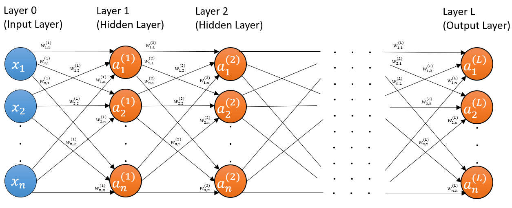

# Deep Learning from Scratch without Machine Learning libraries 

A deep learning module for a standard feedforward neural network designed straight from the mathematical formulations and without reliance on any machine learning focused libraries.

Some ML libraries were used for preprocessing of data in the demonstrations, but none were used for the multilayer perceptron.

## Neural Network Overview

This project includes an implementation of a multilayer perceptron (also known as the standard feedfoward nerual network) and demonstrations using the network.

<i><b> A generalized depiction of a multilayer perceptron.</b></i>

<!-- line break hack for markdown below-->
#### 

For more details see: https://princyok.github.io/implement-a-neural-network-from-scratch.html

## Demonstrations
The multilayer perceptron was used to tackle multiple datasets.

### Chest X-Ray Pneumonia Image Dataset
This is a dataset containing 4273 chest x-ray images of children suffering from pneumonia (both bacterial and viral) and 1592 chest x-ray images of those not suffering from the lung infection.

The neural network model learned to reach a 92% accuracy in predicting whether a patient has pneumonia or not, based on their chest x-ray image. This is despite being less suited for image learning when compared to convolutional neural networks.
The original paper (also source of the dataset) achieved 93%.

The demonstration can be found [here](https://github.com/princyok/deep_learning_without_ml_libraries/tree/master/neural_network_demonstration) (deep_learning_without_ml_libraries -> neural_network_demonstration).

### US Adult Income Dataset

The US adult income dataset contains data on 48842 individuals, and includes fields containing data on their age, education, sex, income level (classed into 2 categories: over 50k or under 50k), etc.

A neural network was trained to reach a 78% accuracy in predicting whether an individual makes over 50k a year or not, based on just data from other fields.

The demonstration can be found [here](https://github.com/princyok/deep_learning_without_ml_libraries/tree/master/neural_network_demonstration) (deep_learning_without_ml_libraries -> neural_network_demonstration).

### Single-unit demonstrations

There are also demonstrations with a simple single-neuron model. They can be found [here](https://github.com/princyok/deep_learning_without_ml_libraries/tree/master/one_neuron_demonstration).